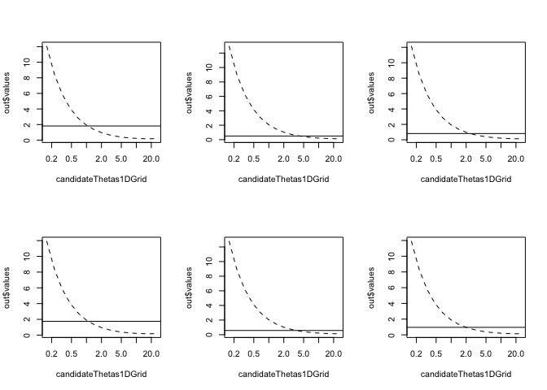
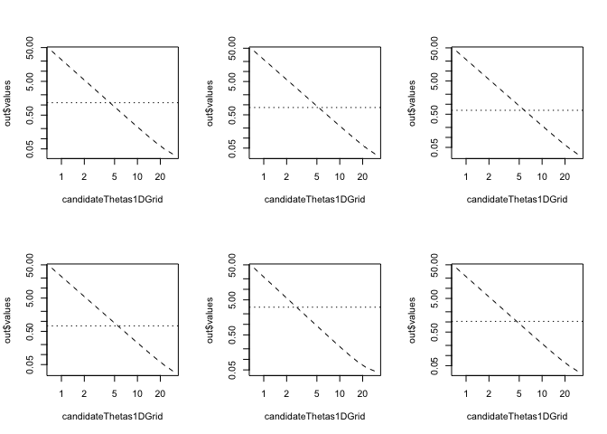
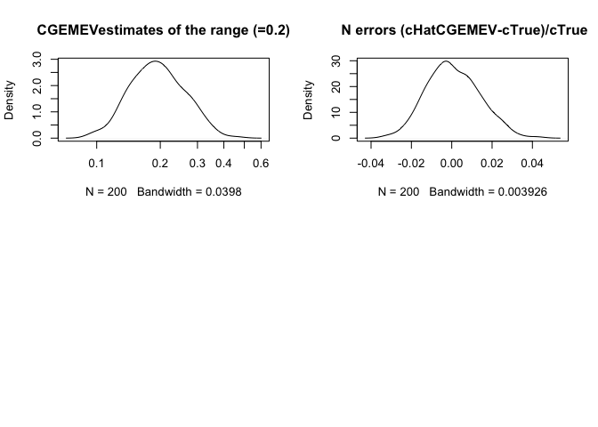

Fitting a Matérn covariance to a (possibly incomplete) lattice observation
==========================================================================

The `CGEMEV` R package provides

-   a simple function for simulating realizations of a stationary isotropic Gaussian process when the correlation belongs to the common Matérn family with smoothness index *nu &gt; 0*
-   tools for estimating, when *nu* is known, the correlation range, also called ''decorrelation length'' (or its inverse that will be denoted *theta*) from one realization on a (possibly incomplete) lattice. The variance of the field is simply estimated by the empirical variance that will be denoted *b<sub>EV</sub>*.

These tools implement the estimation method proposed in Girard, D.A., 2016, Asymptotic near-efficiency of the Gibbs-energy and empirical-variance estimating functions for fitting Matérn models I: Densely sampled processes. Statistics and Probability Letters 110, 191-197, and in the preprint <https://hal.archives-ouvertes.fr/hal-00515832> .

In this first version of `CGEMEV`, the region of missing observations is defined as a union of disks.

Three main functions are used: `gaussian.matern()`, `simulate()` and `fsai11Precond.GEevalOnThetaGrid()`, and a fourth function `grid.domain()` is required to precompute preconditioning sparse matrices.

These R-fonctions can be applied to a quite large grid even on a laptop (for example 512x512, provided the ''extension factor'' required for simulation, see below, is not too big). Indeed quite fast computation of the quadratic form which occurs in the estimating equation is possible by using a conjugate-gradient (CG) solver preconditioned by a classical factored sparse approximate inverse (FSAI) preconditioning, since the matrix-vector product, required in each CG iteration, can be obtained via FFT from the standard embedding of the correlation matrix in a circulant matrix.

Contents
--------

-   [Setting the probabilistic model](#Setting-the-probabilistic-model)
-   [Simulating one realization](#Simulating-one-realisation)
-   [Plotting (and saving) several realizations](#Plotting-(and-saving)-several-realizations)
-   [Setting the uncomplete lattice](#Setting-the-uncomplete-lattice)
-   [Plotting data](#Plotting-data)
-   [Computing (and plotting) the estimating function at log-equispaced ranges](#Computing-(and-plotting)-the-estimating-function-at-log-equispaced-ranges)
-   [Estimating theta and the micro-ergodic parameter](#Estimating-theta-and-the-micro-ergodic-parameter)

Setting the probabilistic model
-------------------------------

In this first version of the `CGEMEV` package, for simplicity, we restrict the spatial domain to be the unit square (0,1)X(0,1). For the example here, the simulations and the choice of observed sites are done using a 128x128 grid which partitions this domain. We consider the example `nu =1` (recall that it is a widely used correlation following the seminal paper by Peter Whittle in Biometrika, 41(3–4), 1954 pp. 434–449). Let us choose the correlation range such that its inverse, denoted *θ*, satisfies $\\sqrt{2 nu}$ *θ*<sup>−1</sup> =0.3 . The resulting correlation function can then be considered as one with an ‘’effective range’‘ equal to 0.3 (the formulae for Matern correlations often use this quantity denoted *ρ*, see <https://en.wikipedia.org/wiki/Mat%C3%A9rn_covariance_function> ).

``` r
library(CGEMEV)
n1grid <- 128
# gaussian matern creation
nu <-1.
effectiveRange <- 0.3
gm <- gaussian.matern(grid.size=n1grid,smoothness=nu,
                      range=effectiveRange/sqrt(2*nu),factor=3)
```

NB: in the previous setting, `factor=3` specifies the required extension factor (assumed, for simplicity, to be an integer) of the observation domain. Indeed for this example the choice `factor=1` or `factor=2` would entail (when calling \`simulate()) the message “FFT of covariance has negative values” which means that generating a realization via the classical embedding method (which doubles each length of the considered rectangular domain) would not work.

Simulating one realization
--------------------------

This is simply:

``` r
set.seed(321)  # so that it is reproducible #
simulate(gm)
```

Plotting (and saving) several realizations
------------------------------------------

We can plot (and save), the previous realization and, for example, 5 further realizations:

``` r
fullLattice.sixZs<- array(NA,c(n1grid*n1grid,6))
set.panel(2,3)
```

    ## plot window will lay out plots in a 2 by 3 matrix

``` r
plot(gm)
fullLattice.sixZs[,1]<-gm$look[1:gm$n1,1:gm$n1]
ut <- system.time(
for (indexReplcitate in 2:6){
  set.seed(320+indexReplcitate)
  simulate(gm)
  plot(gm)
  fullLattice.sixZs[,indexReplcitate]<-gm$look[1:gm$n1,1:gm$n1]
})
```


The following timing (in seconds) is for a MacBookAir Intel I5 1.4GHz :

``` r
ut   # for the simulation of 5 realizations :
```

    ##    user  system elapsed
    ##   9.056   0.212   9.289

Setting the uncomplete lattice
------------------------------

Let us now define the regions (actually 2 disks) where the observations will be missing, and precompute the preconditioning matrix:

``` r
# md=missing.domains
ex1.md <- list(
  list(center=c(0.67841,0.67841),radius=0.17841),
    list(center=c(0.278412, 0.228412),radius=0.071365)
)
# gd=grid.domain
print(system.time(ex1WithN1eq128And2missindDisks.gd <- grid.domain(missing.domains=ex1.md,grid.size=n1grid,
            smoothness=nu)))
```

    ##    user  system elapsed
    ##   9.018   0.644   9.479

Size of the data set:

``` r
dim(ex1WithN1eq128And2missindDisks.gd$sparseG)[1]
```

    ## [1] 14516

Average width of the sparse preconditioner:

``` r
length(ex1WithN1eq128And2missindDisks.gd$sparseG) / dim(ex1WithN1eq128And2missindDisks.gd$sparseG)[1]
```

    ## [1] 77.23732

Plotting observation sites
--------------------------

Each dataset is made up of the observations of one realization of the previous type at the following points:

``` r
xFull<- (1./n1grid)*matrix( c(rep(1: n1grid, n1grid),rep(1: n1grid,each= n1grid)), ncol=2)
x <- xFull[!ex1WithN1eq128And2missindDisks.gd$missing.sites,]
plot(x,asp=1, xlim=c(0,1), ylim=c(0,1), pch=".")
```



Computing (and plotting) the estimating function at log-equispaced ranges
-------------------------------------------------------------------------

Choose a grid of candidates for the range parameter (more precisely, for the inverse-range parameter denoted `theta`) at which the estimating function is computed:

``` r
(thetaTrue  <- 1/gm$range)
```

    ## [1] 4.714045

``` r
candidateThetas1DGrid <- thetaTrue * 10**seq(-0.8,0.8,,15)
```

Consider the first one of the above realizations, and the naive variance estimator *b<sub>EV</sub>*:

``` r
# only observed outside the disks:
#z <- gm$look[1:gm$n1,1:gm$n1][!ex1WithN1eq128And2missindDisks.gd$missing.sites]
indexReplcitate <- 1
z <- fullLattice.sixZs[,indexReplcitate][!ex1WithN1eq128And2missindDisks.gd$missing.sites]
#
(bEV  <- mean(z**2))
```

    ## [1] 1.166006

For this dataset `z`, let us give the whole output of the function `fsai11Precond.GEevalOnThetaGrid()` :

``` r
(out <- fsai11Precond.GEevalOnThetaGridNEW(z,candidateThetas1DGrid,nu=gm$smoothness,                          
grid.domain=ex1WithN1eq128And2missindDisks.gd,tolPGC=1e-04)
)
```

    ## $values
    ##              [,1]
    ##  [1,] 39.30727038
    ##  [2,] 23.22370708
    ##  [3,] 13.72172559
    ##  [4,]  8.10804329
    ##  [5,]  4.79152585
    ##  [6,]  2.83215494
    ##  [7,]  1.67458520
    ##  [8,]  0.99073621
    ##  [9,]  0.58679456
    ## [10,]  0.34827745
    ## [11,]  0.20758431
    ## [12,]  0.12483033
    ## [13,]  0.07653975
    ## [14,]  0.04898283
    ## [15,]  0.03428200
    ##
    ## $niterForY
    ##  [1] 21 19 18 18 16 17 23 18 15 11  9  9 12 18 29

Let us repeat this computation for the five next data sets obtained from the above realizations, and plot the results:

``` r
set.panel(2,3)
```

    ## plot window will lay out plots in a 2 by 3 matrix

``` r
{plot(candidateThetas1DGrid, out$values, , type="l",
                 col=1,lty= "dashed",log="xy")
    abline(h= bEV, lty= "dotted" )
}
ut <- system.time(
for (indexReplcitate in 2:6){
  z <- fullLattice.sixZs[,indexReplcitate][!ex1WithN1eq128And2missindDisks.gd$missing.sites]
  bEV  <- mean(z**2)
  out <-     fsai11Precond.GEevalOnThetaGridNEW(z, candidateThetas1DGrid,
          gm$smoothness, ex1WithN1eq128And2missindDisks.gd ,tolPGC=1e-04)
#  
  plot(candidateThetas1DGrid, out$values, type="l",
                 col=1, lty= "dashed",log="xy")
    abline(h= bEV, lty= "dotted")
})
```



Timing for a MacBookAir Intel I5 1.4GHz :

``` r
ut   # for computing the estimating equation for 5 realizations :
```

    ##    user  system elapsed
    ##  39.261   9.579  48.927

Estimating theta and the micro-ergodic parameter
------------------------------------------------

For solving the estimating equation in theta, a specific bisection method has been elaborated, since it is useful to use "historical" results (more precisely the starting point of the PCG iterations at a given theta is chosen as the solution from the linear-solve associated with the previously considered theta); indeed a classic use of the `uniroot` R-fonction would be much slower.

``` r
nbReplicates <- 200
bHatEV<-matrix(NA,nbReplicates)
cHatGEEV<-matrix(NA, nbReplicates)
thetaHatGEEV<-matrix(NA, nbReplicates)
nCGiterationsMaxForY<-matrix(NA, nbReplicates)
#
ut <- system.time(
for (indexReplcitate in 1: nbReplicates){
  set.seed(320+indexReplcitate)
  simulate(gm)
  z <- gm$look[1:gm$n1,1:gm$n1][!ex1WithN1eq128And2missindDisks.gd$missing.sites]
  bEV  <- mean(z**2)
  out <-     fsai11ThreePreconds.GEbisectionLogScaleSearchNEW(z,
          gm$smoothness, ex1WithN1eq128And2missindDisks.gd ,tolPGC=1e-04,
          0.5, 100,  tolBis=1e-05)
#  
  thetaHatGEEV[indexReplcitate]<- (out$root)
  cHatGEEV[indexReplcitate]<-
                            bEV*(out$root)**(2*gm$smoothness)
  nCGiterationsMaxForY[indexReplcitate]<-
                 max(out$niterCGiterationsHistory)
})
ut
```

    ##     user   system  elapsed
    ## 1735.937  414.030 2153.814

``` r
summary(log(sqrt(2*nu)/thetaHatGEEV,10))
```

    ##        V1         
    ##  Min.   :-0.7719  
    ##  1st Qu.:-0.6330  
    ##  Median :-0.5704  
    ##  Mean   :-0.5562  
    ##  3rd Qu.:-0.4905  
    ##  Max.   :-0.2809

``` r
cTrue <-   1.*(1/gm$range)**(2*gm$smoothness)
summary(cHatGEEV/cTrue)
```

    ##        V1        
    ##  Min.   :0.9643  
    ##  1st Qu.:0.9922  
    ##  Median :0.9998  
    ##  Mean   :0.9998  
    ##  3rd Qu.:1.0068  
    ##  Max.   :1.0462

``` r
sd(cHatGEEV/cTrue)
```

    ## [1] 0.0125211

This sd can be compared to the CR lower bound assuming theta is known

``` r
sqrt(2/length(z))
```

    ## [1] 0.01173793

Let us plot an estimate of the density of the CGEMEV estimates of the effective range:

``` r
den <- density(log(sqrt(2*nu)/thetaHatGEEV,10))
den$x <- 10**(den$x)
plot(den, log="x")
```


