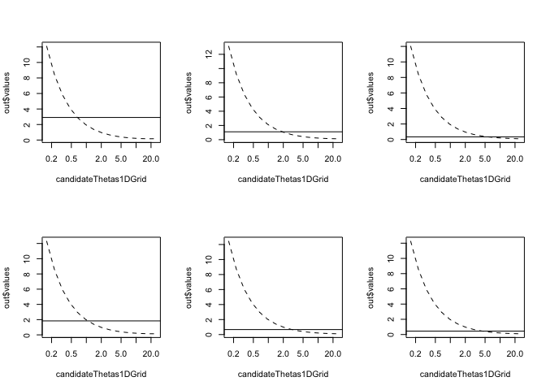

Alternative to Maximum Likelihood for two-parameter Matern Fields
================

Fitting a Matérn covariance to a (possibly incomplete) lattice observation
==========================================================================

The `CGEMEV` R package provides tools for simulating realizations of a stationary isotropic Gaussian process when the correlation belongs to the common Matérn family with known smoothness index \(\nu \geq 0\) and for estimating the correlation range (also called ''decorrelation length'') from one realization on a (possibly incomplete) lattice. The variance of the field is simply estimated by the empirical variance that will be denoted \(b_{EV}\). Presently the missing regions can be chosen to be several disks.

Three main functions are used: `gaussian.matern()`, `simulate()` and `fsai11Precond.GEevalOnThetaGrid()`, and a fourth function `grid.domain()` is required to precompute preconditioning sparse matrices.

These fonctions can be applied to a quite large grid even on a laptop (for example 512x512, provided the ''extension factor'' required for simulation, see below, is not too big). Indeed quite fast computation of the quadratic form which occurs in the estimating equation is possible by using a conjugate-gradient (CG) solver preconditioned by a classical factored sparse approximate inverse (FSAI) preconditioning, since the matrix-vector product, required in each CG iteration, can be obtained via FFT from the standard embedding of the correlation matrix in a circulant matrix.

Contents
--------

-   [Setting the probabilistic model](#Setting-the-probabilistic-model)
-   [Simulating one realization](#Simulating-one-realisation)
-   [Plotting (and saving) several realizations](#Plotting-(and-saving)-several-realizations)
-   [Setting the uncomplete lattice](#Setting-the-uncomplete-lattice)
-   [Plotting data](#Plotting-data)
-   [Computing (and plotting) the estimating function at log-equispaced ranges](#Computing-(and-plotting)-the-estimating-function-at-log-equispaced-ranges)
-   [Estimating theta and the micro-ergodic parameter](#Estimating-theta-and-the-micro-ergodic-parameter)

Setting the probabilistic model
-------------------------------

In this first version of the `CGEMEV` package, for simplicity, we restrict the spatial domain to be the unit square (0,1)X(0,1). For the example here, the simulations and the choice of observed sites are done using a grid 64x64 partitioning this domain.

``` r
library(CGEMEV)
```

    ## Loading required package: Rcpp

    ## 
    ## Attaching package: 'CGEMEV'

    ## The following object is masked from 'package:graphics':
    ## 
    ##     grid

``` r
n1grid<-64
# gaussian matern creation
gm <- gaussian.matern(grid.size=n1grid,smoothness=0.5,range=0.5,factor=3)
```

NB: in the previous setting, ''factor=3'' specifies the required extension factor of the observation domain. Indeed for this example the choice ''factor=1'' or ''factor=2'' would entail (when calling `simulate()`) the message "FFT of covariance has negative values" which means that generating a realization via the classical embedding method (which doubles each length of the considered rectangular domain) would not work.

Simulating one realization
--------------------------

This is simply:

``` r
set.seed(321)  # so that it is reproducible #
simulate(gm)
```

    ## Loading required package: spam

    ## Loading required package: grid

    ## Spam version 1.3-0 (2015-10-24) is loaded.
    ## Type 'help( Spam)' or 'demo( spam)' for a short introduction 
    ## and overview of this package.
    ## Help for individual functions is also obtained by adding the
    ## suffix '.spam' to the function name, e.g. 'help( chol.spam)'.

    ## 
    ## Attaching package: 'spam'

    ## The following objects are masked from 'package:base':
    ## 
    ##     backsolve, forwardsolve

    ## Loading required package: maps

    ## 
    ##  # maps v3.1: updated 'world': all lakes moved to separate new #
    ##  # 'lakes' database. Type '?world' or 'news(package="maps")'.  #

Plotting (and saving) several realizations
------------------------------------------

We can plot (and save), the previous realization and, for example, 5 further realizations:

``` r
fullLattice.sixZs<- array(NA,c(n1grid*n1grid,6))
set.panel(2,3)
```

    ## plot window will lay out plots in a 2 by 3 matrix

``` r
plot(gm)
fullLattice.sixZs[,1]<-gm$look[1:gm$n1,1:gm$n1]
ut <- system.time(
for (indexReplcitate in 2:6){
  set.seed(320+indexReplcitate)
  simulate(gm)
  plot(gm)
  fullLattice.sixZs[,indexReplcitate]<-gm$look[1:gm$n1,1:gm$n1]
  # image(x1,x2,matrix(Ztrue, gm1over2range0p5$n1, gm1over2range0p5$n1),asp=1)}
})
```


The following timing is for a MacBookPro3,1 Intel Core 2 Duo 2.6GHh :

``` r
ut   # for the simulation of 5 realizations :
```

    ##    user  system elapsed 
    ##   9.552   0.285  10.672

Setting the uncomplete lattice
------------------------------

Let us now define the regions (actually 2 disks) where the observations will be missing, and precompute the preconditioning matrix:

``` r
# md=missing.domains
ex1.md <- list(
  list(center=c(0.67841,0.67841),radius=0.17841),
    list(center=c(0.278412, 0.228412),radius=0.071365)
)
# gd=grid.domain
print(system.time(ex1WithN1eq64And2missindDisks.gd <- grid.domain(ex1.md,n1grid)))
```

    ##    user  system elapsed 
    ##   0.246   0.015   0.306

Plotting data
-------------

TODO

Computing (and plotting) the estimating function at log-equispaced ranges
-------------------------------------------------------------------------

Choose a grid of candidates for the range parameter (more precisely, for the inverse-range parameter denoted theta) at which the estimating function is computed:

``` r
candidateThetas1DGrid <- 1/gm$range * 10**seq(-1.1,1.1,,15)
```

Consider the first one of the above realizations, and the naive variance estimator \(b_{\rm EV}\):

``` r
# only observed outside the disks:
#z <- gm$look[1:gm$n1,1:gm$n1][!ex1WithN1eq64And2missindDisks.gd$missing.sites]
indexReplcitate <- 1
z <- fullLattice.sixZs[,indexReplcitate][!ex1WithN1eq64And2missindDisks.gd$missing.sites]
#
(bEV  <- mean(z**2))
```

    ## [1] 2.908545

For this realization, let us give the whole output of the function `fsai11Precond.GEevalOnThetaGrid()` :

``` r
(out <- fsai11Precond.GEevalOnThetaGrid(z,candidateThetas1DGrid,nu=gm$smoothness,                          
grid.domain=ex1WithN1eq64And2missindDisks.gd,tolPGC=1e-03)
)
```

    ## $values
    ##             [,1]
    ##  [1,] 12.1298155
    ##  [2,]  8.4473393
    ##  [3,]  5.8829423
    ##  [4,]  4.0972679
    ##  [5,]  2.8538536
    ##  [6,]  1.9881663
    ##  [7,]  1.3856174
    ##  [8,]  0.9665227
    ##  [9,]  0.6753972
    ## [10,]  0.4738874
    ## [11,]  0.3357479
    ## [12,]  0.2434768
    ## [13,]  0.1865346
    ## [14,]  0.1608699
    ## [15,]  0.1702580
    ## 
    ## $niterForY
    ##  [1] 16 14 14 13 13 13 13 13 14 12 14 17 24 39 59

Let us repeat this computation for the next five data sets obtained from the above realizations, and plot the results:

``` r
set.panel(2,3)
```

    ## plot window will lay out plots in a 2 by 3 matrix

``` r
{plot(candidateThetas1DGrid, out$values, type="l", 
                 col=1, lty=2,log="x")
    abline(h= bEV)
}
ut <- system.time(
for (indexReplcitate in 2:6){
  z <- fullLattice.sixZs[,indexReplcitate][!ex1WithN1eq64And2missindDisks.gd$missing.sites]
  bEV  <- mean(z**2)
  out <- fsai11Precond.GEevalOnThetaGrid(z,candidateThetas1DGrid,
        nu=gm$smoothness,grid.domain=ex1WithN1eq64And2missindDisks.gd,tolPGC=1e-03)
  plot(candidateThetas1DGrid, out$values, type="l", 
                 col=1, lty=2,log="x")
    abline(h= bEV)
})
```



Timing for a MacBookPro3,1 Intel Core 2 Duo 2.6GHh :

``` r
ut   # for computing the estimating equation for 5 realizations :
```

    ##    user  system elapsed 
    ##  22.582   3.510  30.399

Estimating theta and the micro-ergodic parameter
------------------------------------------------

TODO \#
