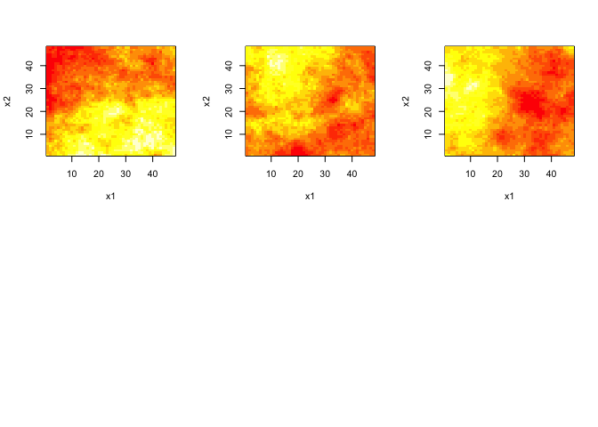
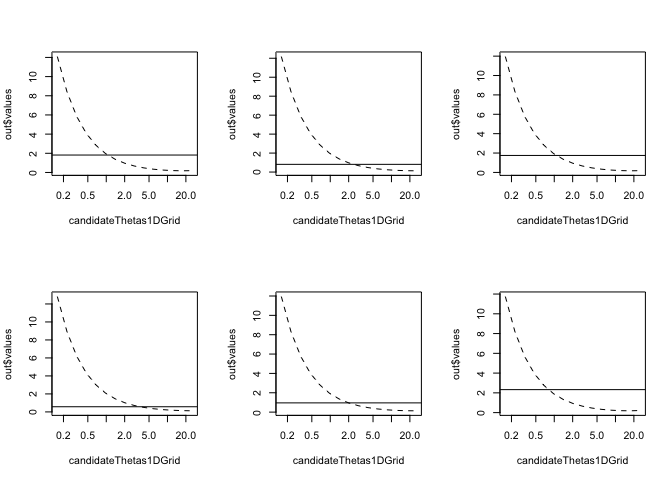
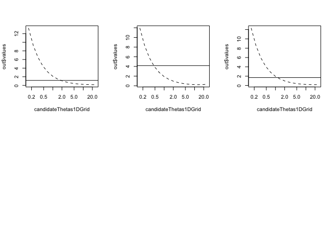

Alternative to Maximum Likelihood for two-parameter Matern Fields
================

Fitting a Matérn covariance to a (possibly noisy) incomplete lattice observation
================================================================================

The `CGEMEV` R package provides tools for simulating realisations of a stationary isotropic Gaussian process when the correlation belongs to the common Matérn family with known regularity index \(\nu \geq 0\) and for estimating the correlation range (also called \`\`decorrelation length'') from one realisation on a (possibly incomplete) lattice. The variance of the field is simply estimated by the empirical variance that will be denoted \(b_{\rm EV}\). Presently the missing regions can be chosen to be several disks.

Three main functions are used: `gaussian.matern()`, `simulate()` and `fsai11Precond.GEevalOnThetaGrid()`, and a fourth function `grid.domain()` is required to precompute preconditioning sparse matrices.

These fonctions can be applied to a quite large grid (for example 512x512) even on a laptop. Indeed very fast computation of the quadratic form which occurs in the estimating equation is possible by using a conjugate-gradient (CG) solver preconditioned by a classical factored sparse approximate inverse (FSAI) preconditioning, the matrix-vector product, required in each CG iteration, being obtained via FFT from the standard embedding of in a circulant matrix.

Contents
--------

-   [Setting the probabilistic model](#Setting-the-probabilistic-model)
-   [Simulating one (or several) realisations](#Simulating-one-(or-several)-realisations)
-   [Plots of the random fields](#plots-of-the-random-fields)
-   [Setting the uncomplete lattice](#setting-th-uncomplete-lattice)
-   [Plotting data](#Plotting-data)
-   [Plotting the estimating function](#plotting-the-estimating-function)
-   [Estimating theta and the micro-ergodic parameter](#estimating-theta-and-the-micro-ergodic-parameter)

Setting the probabilistic model
-------------------------------

In this first version of the `CGEMEV` package, we restrict ourselves to a simple domain \[0,1\]X\[0,1\]. For the example here, the simulations and the choice of observed sites are done using a grid 48x48

``` r
library(CGEMEV)
```

    ## Loading required package: Rcpp

    ## 
    ## Attaching package: 'CGEMEV'

    ## The following object is masked from 'package:graphics':
    ## 
    ##     grid

``` r
#
n1grid<-48
cat("gaussian matern creation\n")
```

    ## gaussian matern creation

``` r
gm <- gaussian.matern(grid.size=n1grid,smoothness=0.5,range=0.5,factor=2)
cat("-> done\n")
```

    ## -> done

NB: in the previous setting, factor=2 specifies the required extension factor of the observation domain. Indeed for this example the choice factor=1 would have entailed the message "FFT of covariance has negative values" which means that the embedding method (which doubles each length of the considered rectangular domain) would have not worked

Simulating one (or several) realisations
----------------------------------------

``` r
cat("simulation and plot\n")
```

    ## simulation and plot

``` r
set.seed(321)  # so that it is reproducible #
simulate(gm)
```

    ## Loading required package: spam

    ## Loading required package: grid

    ## Spam version 1.3-0 (2015-10-24) is loaded.
    ## Type 'help( Spam)' or 'demo( spam)' for a short introduction 
    ## and overview of this package.
    ## Help for individual functions is also obtained by adding the
    ## suffix '.spam' to the function name, e.g. 'help( chol.spam)'.

    ## 
    ## Attaching package: 'spam'

    ## The following objects are masked from 'package:base':
    ## 
    ##     backsolve, forwardsolve

    ## Loading required package: maps

    ## 
    ##  # maps v3.1: updated 'world': all lakes moved to separate new #
    ##  # 'lakes' database. Type '?world' or 'news(package="maps")'.  #

Plots of the random fields
--------------------------

We can plot (and save), for example, 9 realizations:

``` r
fullLattice.nineZs<- array(NA,c(n1grid*n1grid,9))
set.panel(2,3)
```

    ## plot window will lay out plots in a 2 by 3 matrix

``` r
plot(gm)
fullLattice.nineZs[,1]<-gm$look[1:gm$n1,1:gm$n1]
ut <- system.time(
for (indexReplcitate in 2:9){
  set.seed(321+indexReplcitate)
  simulate(gm)
  plot(gm)
  fullLattice.nineZs[,indexReplcitate]<-gm$look[1:gm$n1,1:gm$n1]
  # image(x1,x2,matrix(Ztrue, gm1over2range0p5$n1, gm1over2range0p5$n1),asp=1)}
})
```



The following timing is for a MacBookPro3,1 Intel Core 2 Duo 2.6GHh :

``` r
ut   # for the simulation of 8 realisations :
```

    ##    user  system elapsed 
    ##   4.356   0.107   4.844

Setting the uncomplete lattice
------------------------------

Let us now define the regions (actually 2 disks) where the observations will be missing, and precompute the preconditioning matrix:

``` r
# md=missing.domains
ex1.md <- list(
  list(center=c(0.67841,0.67841),radius=0.17841),
    list(center=c(0.278412, 0.228412),radius=0.071365)
)
# gd=grid.domain
print(system.time(ex1WithN1eq48And2missindDisks.gd <- grid.domain(ex1.md,n1grid)))
```

    ##    user  system elapsed 
    ##   0.190   0.012   0.341

Plotting data
-------------

TODO

Plotting the estimating function
--------------------------------

Consider the first one of the above realizations, and the naive variance estimator \(b_{\rm EV}\):

``` r
# only observed outside the disks:
#z <- gm$look[1:gm$n1,1:gm$n1][!ex1WithN1eq48And2missindDisks.gd$missing.sites]
indexReplcitate <- 1
z <- fullLattice.nineZs[,indexReplcitate][!ex1WithN1eq48And2missindDisks.gd$missing.sites]
#
(bEV  <- mean(z**2))
```

    ## [1] 1.817604

``` r
#
candidateThetas1DGrid <- 1/gm$range * 10**seq(-1.1,1.1,,15)

(out <- fsai11Precond.GEevalOnThetaGrid(z,candidateThetas1DGrid,nu=gm$smoothness,grid.domain=ex1WithN1eq48And2missindDisks.gd,tolPGC=1e-03) )
```

    ## $values
    ##             [,1]
    ##  [1,] 12.0933720
    ##  [2,]  8.4223872
    ##  [3,]  5.8659804
    ##  [4,]  4.0858401
    ##  [5,]  2.8463340
    ##  [6,]  1.9834128
    ##  [7,]  1.3828622
    ##  [8,]  0.9652463
    ##  [9,]  0.6753814
    ## [10,]  0.4751469
    ## [11,]  0.3384415
    ## [12,]  0.2482045
    ## [13,]  0.1942022
    ## [14,]  0.1730623
    ## [15,]  0.1892506
    ## 
    ## $niterForY
    ##  [1] 17 17 16 15 15 14 14 14 13  9 16 19 26 40 66

``` r
#
#
#
set.panel(2,3)
```

    ## plot window will lay out plots in a 2 by 3 matrix

``` r
{plot(candidateThetas1DGrid, out$values, type="l", 
                 col=1, lty=2,log="x")
    abline(h= bEV)
}
ut <- system.time(
for (indexReplcitate in 2:9){
  z <- fullLattice.nineZs[,indexReplcitate][!ex1WithN1eq48And2missindDisks.gd$missing.sites]
  bEV  <- mean(z**2)
  out <- fsai11Precond.GEevalOnThetaGrid(z,candidateThetas1DGrid,
        nu=gm$smoothness,grid.domain=ex1WithN1eq48And2missindDisks.gd,tolPGC=1e-03)
  plot(candidateThetas1DGrid, out$values, type="l", 
                 col=1, lty=2,log="x")
    abline(h= bEV)
})
```



Timing for a MacBookPro3,1 Intel Core 2 Duo 2.6GHh :

``` r
ut   # for computing the estimating equation for 8 realisations :
```

    ##    user  system elapsed 
    ##  33.333   2.435  37.316

Estimating theta and the micro-ergodic parameter
------------------------------------------------

TODO \#
