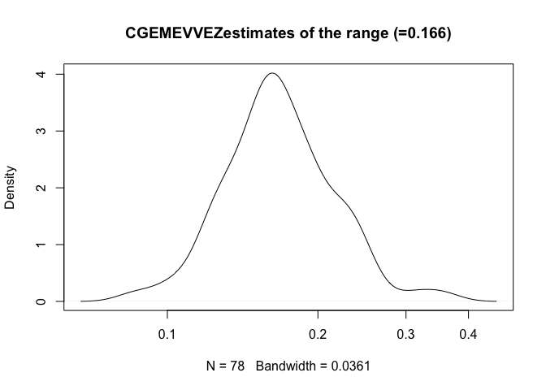

# Fitting a Matérn covariance to a (possibly  incomplete) lattice observation

The   `CGEMEV` R package (dependent on the fields, spam, SpatialVx and RCPP packages) provides

- a simple function for simulating realizations of a stationary isotropic Gaussian process when the correlation belongs to the common Matérn family with smoothness index  *nu > 0*
- tools for estimating, when *nu* is known and  the level *sigma<sub>NOISE</sub>* of the possible \`\`measurement errors'' is either known or unknown,  the correlation  range, also called ''decorrelation length'' (or its inverse that will be denoted *theta*) from one realization on a (possibly incomplete) lattice.
The variance of the field is simply estimated by the empirical variance that will be denoted *b<sub>EV</sub>*.

These tools implement the estimation method proposed in Girard, D.A., 2016, Asymptotic near-efficiency of the Gibbs-energy and empirical-variance estimating functions for fitting Matérn models I: Densely sampled processes. Statistics and Probability Letters 110, 191-197,   and in the preprint https://hal.archives-ouvertes.fr/hal-00515832 .

In this first version of `CGEMEV`, the region of missing observations is defined as a union of  disks.

Three main functions are used: `gaussian.matern()`, `simulate()`
and `fsai11Precond.GEevalOnThetaGrid()`,    `fsaiThreePrecond.fastRandzedCGEMEVbisectionLogScaleSearch()` and a fifth function `grid.domain()` is required to precompute preconditioning sparse matrices.


These R-fonctions can be applied to a quite large grid even on a laptop (for example 512x512, provided the ''extension factor'' required for simulation, see below, is not too big). Indeed quite fast
computation of the quadratic form which occurs in the estimating equation is possible by using a conjugate-gradient (CG) solver preconditioned by a classical factored sparse approximate inverse (FSAI) preconditioning, since the matrix-vector product, required in each CG iteration,  can be obtained via FFT from the standard embedding of the correlation matrix  in a circulant  matrix.

## Contents

- [Setting the probabilistic model](#Setting-the-probabilistic-model)
- [Simulating one realization](#Simulating-one-realisation)
- [Plotting (and saving) several realizations](#Plotting-(and-saving)-several-realizations)
- [Setting the uncomplete lattice](#Setting-the-uncomplete-lattice)
- [Plotting data](#Plotting-data)
- [Computing (and plotting) the estimating function at log-equispaced ranges](#Computing-(and-plotting)-the-estimating-function-at-log-equispaced-ranges)
- [Estimating theta and the micro-ergodic parameter](#Estimating-theta-and-the-micro-ergodic-parameter)

## Setting the probabilistic model

In this first version of the  `CGEMEV` package, for simplicity, we restrict the spatial domain to be the unit square (0,1)X(0,1). For the example here, the simulations and the choice of observed sites are done using a 108x108 grid which partitions this domain. We consider the example `nu =0.5` (that this the widely used exponential correlation).
Let us choose the correlation  range such that its inverse, denoted $\theta$, satisfies $\sqrt{2 nu} \theta^{-1} =0.166667$.
The resulting correlation function can then be considered as one with an  ‘’effective range’‘ equal to $0.166667$ (the formulae for Matern correlations often use this quantity denoted $\rho$, see https://en.wikipedia.org/wiki/Mat%C3%A9rn_covariance_function ).


```r
library(CGEMEV)
```

```
## Loading required package: Rcpp
```

```
## 
## Attaching package: 'CGEMEV'
```

```
## The following object is masked from 'package:graphics':
## 
##     grid
```

```r
library(pdist)
n1grid <- 108
# gaussian matern creation
nu <-0.5
effectiveRange <- 0.166667
gm <- gaussian.matern(grid.size=n1grid,smoothness=nu,
                      range=effectiveRange/sqrt(2*nu),factor=2)
```
NB: in the previous setting, `factor=2`  specifies the required extension factor (assumed, for simplicity, to be an integer) of the observation domain. Indeed for this example the choice `factor=1` would entail (when calling `simulate(gm)`) the message “FFT of covariance has negative values” which means that generating a realization via the classical embedding method (which doubles each length of the considered rectangular domain) would not work.

## Simulating one realization

This is simply:

```r
set.seed(321)  # so that it is reproducible #
simulate(gm)
```

```
## Loading required package: spam
```

```
## Loading required package: dotCall64
```

```
## Loading required package: grid
```

```
## Spam version 2.2-0 (2018-06-19) is loaded.
## Type 'help( Spam)' or 'demo( spam)' for a short introduction 
## and overview of this package.
## Help for individual functions is also obtained by adding the
## suffix '.spam' to the function name, e.g. 'help( chol.spam)'.
```

```
## 
## Attaching package: 'spam'
```

```
## The following objects are masked from 'package:base':
## 
##     backsolve, forwardsolve
```

```
## Loading required package: maps
```

```
## See www.image.ucar.edu/~nychka/Fields for
##  a vignette and other supplements.
```

## Plotting (and saving) several realizations

We can plot (and save), the previous realization and, for example, 5 further realizations:


```r
fullLattice.sixZs<- array(NA,c(n1grid*n1grid,6))
set.panel(2,3)
```

```
## plot window will lay out plots in a 2 by 3 matrix
```

```r
plot(gm)
fullLattice.sixZs[,1]<-gm$look[1:gm$n1,1:gm$n1]
ut <- system.time(
for (indexReplcitate in 2:6){
  set.seed(320+indexReplcitate)
  simulate(gm)
  plot(gm)
  fullLattice.sixZs[,indexReplcitate]<-gm$look[1:gm$n1,1:gm$n1]
})
```

<!-- -->

The following timing (in seconds) is for a iMac (Mid-2017) 	4.2 GHz Core i7 (I7-7700K) :

```r
ut   # for the simulation of 5 realizations :
```

```
##    user  system elapsed 
##   0.875   0.017   0.905
```


## Setting the uncomplete lattice

Let us now define the regions  (actually 5 disks) where the observations will be missing, and precompute the preconditioning matrix:

```r
# md=missing.domains
listOfHalfDiameters <- c(1,0.4,0.2,0.1,0.05)*sqrt(.1/ pi)

listOfCenters <- t(matrix(c(c(0.5+sqrt(.1/ pi),0.5+sqrt(.1/ pi)),c(0.1+sqrt(.1/ pi),
0.05+sqrt(.1/ pi)),c(0.8,0.25),c(0.2,0.8),c(0.3,0.7)),2,length(listOfHalfDiameters)))


ex1.md <- list(
  list(center=listOfCenters[1,],radius= listOfHalfDiameters[1]),
list(center=listOfCenters[2,],radius= listOfHalfDiameters[2]),
list(center=listOfCenters[3,],radius= listOfHalfDiameters[3]),
list(center=listOfCenters[4,],radius= listOfHalfDiameters[4]),
list(center=listOfCenters[5,],radius= listOfHalfDiameters[5])
)
# gd=grid.domain
print(system.time(ex1WithN1eq108And5missindDisks.gd <- grid.domain(missing.domains=ex1.md,grid.size=n1grid,
            smoothness=nu)))
```

```
##    user  system elapsed 
##   3.719   0.267   3.825
```


Size of the data set:

```r
(nObs <- dim(ex1WithN1eq108And5missindDisks.gd$sparseG)[1])
```

```
## [1] 10274
```
Average width of the sparse preconditioner:

```r
length(ex1WithN1eq108And5missindDisks.gd$sparseG) / dim(ex1WithN1eq108And5missindDisks.gd$sparseG)[1]
```

```
## [1] 64.51041
```

## Plotting observation sites

Each dataset is made up of the observations of one realization of the previous type at the following points:

```r
xFull<- (1./n1grid)*matrix( c(rep(1: n1grid, n1grid),rep(1: n1grid,each= n1grid)), ncol=2)
x <- xFull[!ex1WithN1eq108And5missindDisks.gd$missing.sites,]
plot(x,asp=1, xlim=c(0,1), ylim=c(0,1), pch=".")
```

<!-- -->


## No-noise case : Computing (and plotting) the estimating function at log-equispaced ranges

Choose a grid of candidates for the range parameter (more precisely, for the inverse-range parameter denoted `theta`) at which the estimating function is computed:

```r
(thetaTrue  <- 1/gm$range)
```

```
## [1] 5.999988
```


```r
candidateThetas1DGrid <- thetaTrue * 10**seq(-0.8,0.8,,15)
```
Consider the first one of the above realizations, and the naive variance estimator *b<sub>EV</sub>*:

```r
# only observed outside the disks:
#z <- gm$look[1:gm$n1,1:gm$n1][!ex1WithN1eq108And5missindDisks.gd$missing.sites]
indexReplcitate <- 1
z <- fullLattice.sixZs[,indexReplcitate][!ex1WithN1eq108And5missindDisks.gd$missing.sites]
#
(bEV  <- mean(z**2))
```

```
## [1] 1.565748
```
For this dataset `z`, let us give the whole output of the function `fsai11Precond.GEevalOnThetaGrid()` :

```r
(out <- fsai11Precond.GEevalOnThetaGridNEW(z,candidateThetas1DGrid,nu=gm$smoothness,                          
grid.domain=ex1WithN1eq108And5missindDisks.gd,tolPGC=1e-04)
)
```

```
## $values
##            [,1]
##  [1,] 6.1436905
##  [2,] 4.7225957
##  [3,] 3.6303922
##  [4,] 2.7910355
##  [5,] 2.1460644
##  [6,] 1.6505654
##  [7,] 1.2700368
##  [8,] 0.9780007
##  [9,] 0.7541657
## [10,] 0.5830346
## [11,] 0.4528530
## [12,] 0.3548433
## [13,] 0.2826814
## [14,] 0.2321890
## [15,] 0.2012737
## 
## $niterForY
##  [1] 13 10 10 10 10 13 10  8  7  6  6  8 12 17 20
```
Let us repeat this computation for the five next data sets obtained from the above realizations, and plot the results:

```r
set.panel(2,3)
```

```
## plot window will lay out plots in a 2 by 3 matrix
```

```r
{plot(candidateThetas1DGrid, out$values,  type="l",
                 col=1,lty= "dashed",log="xy")
    abline(h= bEV, lty= "dotted" )
}
ut <- system.time(
for (indexReplcitate in 2:6){
  z <- fullLattice.sixZs[,indexReplcitate][!ex1WithN1eq108And5missindDisks.gd$missing.sites]
  bEV  <- mean(z**2)
  out <- 	 fsai11Precond.GEevalOnThetaGridNEW(z, candidateThetas1DGrid,
		  gm$smoothness, ex1WithN1eq108And5missindDisks.gd ,tolPGC=1e-04)
#  
  plot(candidateThetas1DGrid, out$values, type="l",
                 col=1, lty= "dashed",log="xy")
    abline(h= bEV, lty= "dotted")
})
```

<!-- -->

Timing with a iMac (Mid-2017) 	4.2 GHz I7-7700K (using one core) :

```r
ut   # for computing the estimating equation for 5 realizations :
```

```
##    user  system elapsed 
##   8.842   0.512   9.384
```


## Estimating theta and the micro-ergodic parameter from noisy observations with (unknown) SNR $= 33^2$, known *sigma<sub>NOISE</sub>* 

For solving the CGEMEV estimating equation in theta, a specific bisection method has been elaborated, since it is useful to use "historical" results (more precisely the starting point of the PCG iterations at a given theta is chosen as the solution from the linear-solve associated with the previously considered theta); indeed a classic use of the `uniroot` R-fonction would be much slower. Let us analyse N=100 datasets *Y<sub>k</sub>*, *k=1,...,100* each one being *Y<sub>k</sub> = Z<sub>k</sub> +epsilon<sub>k</sub> *, where *epsilon<sub>k</sub>* is a field of white normal noise; they are simulated such that the true SNR (i.e. var(Z)/var(noise)) $= 33^2$. Only *nu* and the variance of the noise (or nugget-effect variance, $=1$) are assumed known.


```r
sigma2Process<- 33^2
sigma2Noise <- 1.
bTrue <- sigma2Process/sigma2Noise

nbReplicates <- 100
bHatEV<-matrix(NA,nbReplicates)
cHatCGEMEV<-matrix(NA, nbReplicates)
thetaHatCGEMEV<-matrix(NA, nbReplicates)
nCGiterationsMaxForY<-matrix(NA, nbReplicates)
#
ut <- system.time(
for (indexReplcitate in 1: nbReplicates){
  set.seed(720+indexReplcitate)
  simulate(gm)
  z <- gm$look[1:gm$n1,1:gm$n1][!ex1WithN1eq108And5missindDisks.gd$missing.sites]
  y <-  sqrt(bTrue)* z +  c(rnorm(nObs))
#
  bEV  <- ( mean(y**2)-sigma2Noise ) / sigma2Noise
  if (bEV <0) {
            break}
  w <-  c(rnorm(nObs))
  out <-     fsaiThreePrecond.fastRandzedCGEMEVbisectionLogScaleSearch(
          sigma2Noise,y,
          w,
          gm$smoothness, ex1WithN1eq108And5missindDisks.gd ,tolPGC=1e-04,
          0.2,50, tolBis=1e-05)

#  
  thetaHatCGEMEV[indexReplcitate]<- (out$root)
  cHatCGEMEV[indexReplcitate]<-
                            bEV*(out$root)**(2*gm$smoothness)
  nCGiterationsMaxForY[indexReplcitate]<-
                 max(out$niterCGiterationsHistory)
})
```


Timing  for these 100 replicates, with a iMac (Mid-2017) 	4.2 GHz I7-7700K (using one core) :

```r
ut
```

```
##    user  system elapsed 
## 291.473  17.082 309.054
```

Summary of the results:


```r
print(c("log10 of true range =",log(sqrt(2*nu)*gm$range,10)))
```

```
## [1] "log10 of true range =" "-0.778150381795548"
```


```r
summary(log(sqrt(2*nu)/thetaHatCGEMEV,10))
```

```
##        V1         
##  Min.   :-1.0056  
##  1st Qu.:-0.8566  
##  Median :-0.7785  
##  Mean   :-0.7744  
##  3rd Qu.:-0.6998  
##  Max.   :-0.5164
```


```r
cTrue <-  bTrue*(1/gm$range)**(2*gm$smoothness)
summary(cHatCGEMEV/cTrue)
```

```
##        V1        
##  Min.   :0.9652  
##  1st Qu.:0.9916  
##  Median :1.0012  
##  Mean   :1.0017  
##  3rd Qu.:1.0114  
##  Max.   :1.0489
```


```r
sd(cHatCGEMEV/cTrue)
```

```
## [1] 0.0143593
```


This sd can be compared to the CR lower bound for the case known theta and no-noise

```r
sqrt(2/length(z))
```

```
## [1] 0.01395228
```

Let us plot an estimate of the density of the CGEMEV estimates of the effective range, and of the density of the relative errors in the CGEMEV estimates of the microergodic-parameter cTrue:


```r
set.panel(2,2)
```

```
## plot window will lay out plots in a 2 by 2 matrix
```

    ## plot window will lay out plots in a 2 by 2 matrix


```r
den <- density(log(sqrt(2*nu)/thetaHatCGEMEV,10))
den$x <- 10**(den$x)
plot(den, log="x",main="")
title("CGEMEVestimates of the range (=0.166)")
```

<!-- -->

```r
plot(density((cHatCGEMEV-cTrue)/cTrue),main="")
title(" N errors (cHatCGEMEV-cTrue)/cTrue")
```

<!-- -->


## Estimating theta and the micro-ergodic parameter from noisy observations with (unknown) SNR $= 33^2$, unknown *sigma<sub>NOISE</sub>*: CGEM-EV-VEZ method 


In a first stage, the variance of the noise (or nugget-effect), whose true value $=1$, is  estimated  by extrapolating at zero the classical semi-variogram (using maximum lag set to 3); this estimate is stored in  `sigma2NoiseVEZ`  (this method was proposed in Matthias Katzfuss and
Noel Cressie. Bayesian hierarchical spatio‐temporal smoothing for very large datasets. Environmetrics. February 2012. pp 94-107). The second stage is a simple "plugin" of `sigma2NoiseVEZ` in CGEM-EV in place of the true variance :


```r
#################################################################
## definition of sig2noiseByVariogExtrapolAtZeroNew #############
#################################################################
library(SpatialVx)
```

```
## Loading required package: spatstat
```

```
## Loading required package: spatstat.data
```

```
## Loading required package: nlme
```

```
## Loading required package: rpart
```

```
## 
## spatstat 1.56-1       (nickname: 'Invisible Friend') 
## For an introduction to spatstat, type 'beginner'
```

```
## 
## Note: R version 3.5.1 (2018-07-02) is more than 9 months old; we strongly recommend upgrading to the latest version
```

```
## Loading required package: smoothie
```

```
## Loading required package: smatr
```

```
## Loading required package: turboEM
```

```
## Loading required package: doParallel
```

```
## Loading required package: foreach
```

```
## Loading required package: iterators
```

```
## Loading required package: parallel
```

```
## Loading required package: numDeriv
```

```
## Loading required package: quantreg
```

```
## Loading required package: SparseM
```

```
## 
## Attaching package: 'SparseM'
```

```
## The following object is masked from 'package:spam':
## 
##     backsolve
```

```
## The following object is masked from 'package:base':
## 
##     backsolve
```

```
## 
## Attaching package: 'turboEM'
```

```
## The following objects are masked from 'package:numDeriv':
## 
##     grad, hessian
```

```r
#help(structurogram.matrix)
sig2noiseByVariogExtrapolAtZeroNew <- function(y,n1grid,n2grid,
maxLag=5)
{#  missingPositions have zero value
  	tmp <- array(y,c(n1grid,n2grid))
  #
	outWithMissing<-structurogram.matrix(tmp,zero.out=TRUE,R=maxLag)
	variog<-outWithMissing$vgram
	lag<-outWithMissing$d
	lag2<-lag^2
	quadratic.model <-lm(variog ~ lag + lag2)
	#
	sig2noiseVEZ <-quadratic.model$coefficients[1]
#
sig2noiseVEZ
}
## end of sig2noiseByVariogExtrapolAtZero ################
##########################################################
```


```r
nbReplicates <-100
failureOfVEZ<-matrix(FALSE,nbReplicates)
```


```r
sigma2Process<- 33^2
sigma2Noise <- 1.
bTrue <- sigma2Process/sigma2Noise


bHatEVsigma2NoiseVEZ<-matrix(NA,nbReplicates)
cHatCGEMEVsigma2NoiseVEZ<-matrix(NA, nbReplicates)
thetaHatCGEMEVsigma2NoiseVEZ<-matrix(NA, nbReplicates)
nCGiterationsMaxForYsigma2NoiseVEZ<-matrix(NA, nbReplicates)
sigma2NoiseVEZ<-matrix(NA, nbReplicates)

#
maxLag <-3
ut <- system.time(
for (indexReplcitate in 1: nbReplicates){
  set.seed(720+indexReplcitate)
  simulate(gm)
  z <- gm$look[1:gm$n1,1:gm$n1][!ex1WithN1eq108And5missindDisks.gd$missing.sites]
  y <-  sqrt(bTrue)* z +  c(rnorm(nObs))
  # compute bHatEVsigma2NoiseVEZ
  Yrepl<-rep(NA,gm$n1*gm$n1)
      Yrepl[!ex1WithN1eq108And5missindDisks.gd$missing.sites] <- y
      minOfimageMinus1 <- min(Yrepl,na.rm=TRUE)-1
      YreplOffset<-Yrepl-rep(minOfimageMinus1,gm$n1*gm$n1)
      YreplOffsetWithZeroInsteadNA <- YreplOffset
      YreplOffsetWithZeroInsteadNA[is.na(Yrepl)] <-0
      estimation <- 
        sig2noiseByVariogExtrapolAtZeroNew(YreplOffsetWithZeroInsteadNA,gm$n1,gm$n1,maxLag=maxLag)
      #
      lowerBound <- 10**(-12)*mean(y**2)    
      sigma2NoiseVEZ[indexReplcitate] <- max(c(lowerBound,estimation),na.rm=TRUE)
  if (sigma2NoiseVEZ[indexReplcitate]==lowerBound) failureOfVEZ[indexReplcitate] <- TRUE
    #
  else
  {bEV  <- ( mean(y**2)-sigma2NoiseVEZ[indexReplcitate] )/ sigma2NoiseVEZ[indexReplcitate]
    if (bEV <0) {
            break}
    w <-  c(rnorm(nObs))
    out <-     fsaiThreePrecond.fastRandzedCGEMEVbisectionLogScaleSearch(
           sigma2NoiseVEZ[indexReplcitate] ,y,
          w,
          gm$smoothness, ex1WithN1eq108And5missindDisks.gd ,tolPGC=1e-04,
        0.2,50, tolBis=1e-05)
   #
   #  
   thetaHatCGEMEVsigma2NoiseVEZ[indexReplcitate] <- (out$root)
   cHatCGEMEVsigma2NoiseVEZ[indexReplcitate]<-
        ( mean(y**2)-sigma2NoiseVEZ[indexReplcitate] ) * (out$root)**(2*gm$smoothness)
   #
   nCGiterationsMaxForYsigma2NoiseVEZ[indexReplcitate]<-
                 max(out$niterCGiterationsHistory)
  }
})
```
Number of non-failure of VEZ

```r
(numberOfNonFailureOfVEZ <- sum(failureOfVEZ==FALSE))
```

```
## [1] 75
```
Timing  for these replicates (including the extrapolations of each empirical varogriam), using 
a iMac (Mid-2017) 	4.2 GHz I7-7700K (using one core)


```r
ut
```

```
##    user  system elapsed 
## 225.918  14.253 240.570
```

Summary of the results:


```r
print(c("log10 of true range =",log(sqrt(2*nu)*gm$range,10)))
```

```
## [1] "log10 of true range =" "-0.778150381795548"
```


```r
summary(log(sqrt(2*nu)/thetaHatCGEMEVsigma2NoiseVEZ,10))
```

```
##        V1         
##  Min.   :-1.0056  
##  1st Qu.:-0.8835  
##  Median :-0.7937  
##  Mean   :-0.7884  
##  3rd Qu.:-0.7053  
##  Max.   :-0.5182  
##  NA's   :25
```


```r
cTrue <-  bTrue*(1/gm$range)**(2*gm$smoothness)
summary(cHatCGEMEVsigma2NoiseVEZ/cTrue)
```

```
##        V1        
##  Min.   :0.9813  
##  1st Qu.:1.0025  
##  Median :1.0151  
##  Mean   :1.0351  
##  3rd Qu.:1.0393  
##  Max.   :1.2527  
##  NA's   :25
```


```r
sd(cHatCGEMEVsigma2NoiseVEZ/cTrue,na.rm=TRUE)
```

```
## [1] 0.05687254
```


This sd can be compared to the CR lower bound for the case known theta and no-noise

```r
sqrt(2/length(z))
```

```
## [1] 0.01395228
```

Let us plot an estimate of the density of the CGEM-EV-VEZ estimates of the effective range, and of the density of the relative errors in the CGEM-EV-VEZ estimates of the microergodic-parameter cTrue:


```
## plot window will lay out plots in a 2 by 2 matrix
```


```r
den <- density(log(sqrt(2*nu)/thetaHatCGEMEVsigma2NoiseVEZ,10),na.rm=TRUE)
den$x <- 10**(den$x)
plot(den, log="x",main="")
title("CGEMEVVEZestimates of the range (=0.166)")
```

<!-- -->

```r
plot(density((cHatCGEMEVsigma2NoiseVEZ-cTrue)/cTrue,na.rm=TRUE),main="")
title(" N errors (cHatCGEMEVVEZ-cTrue)/cTrue")
```

<!-- -->
